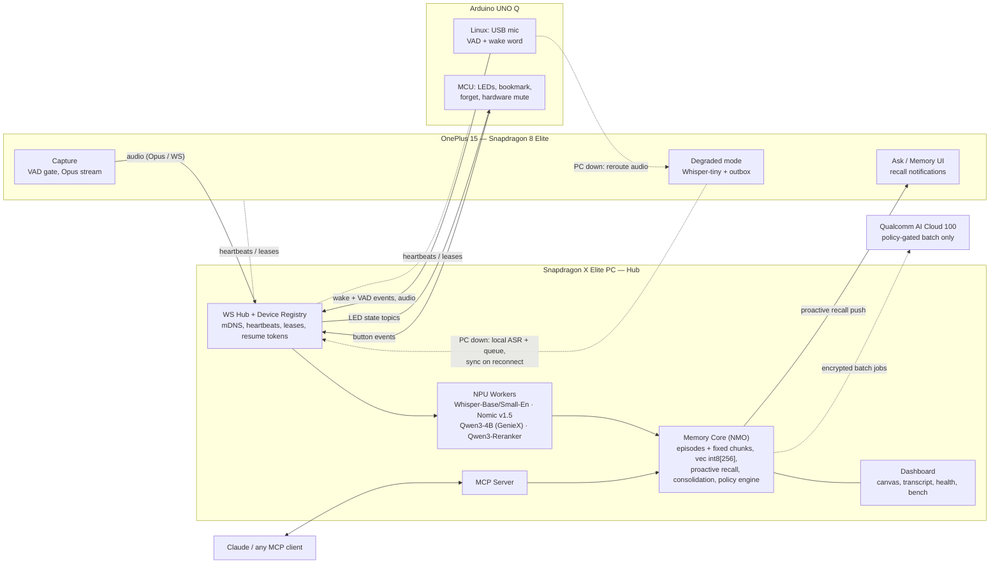
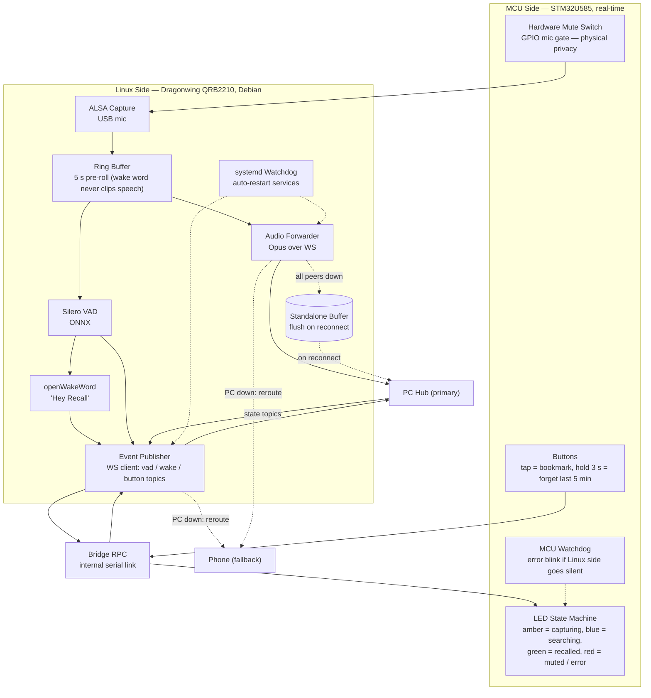
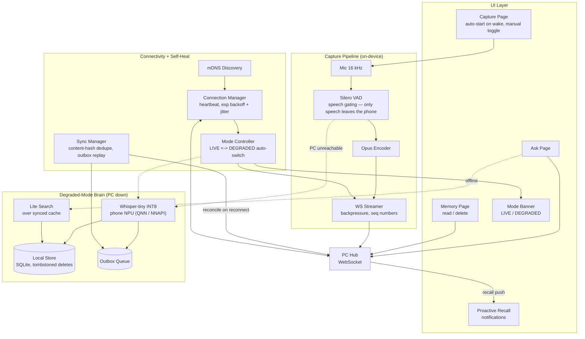
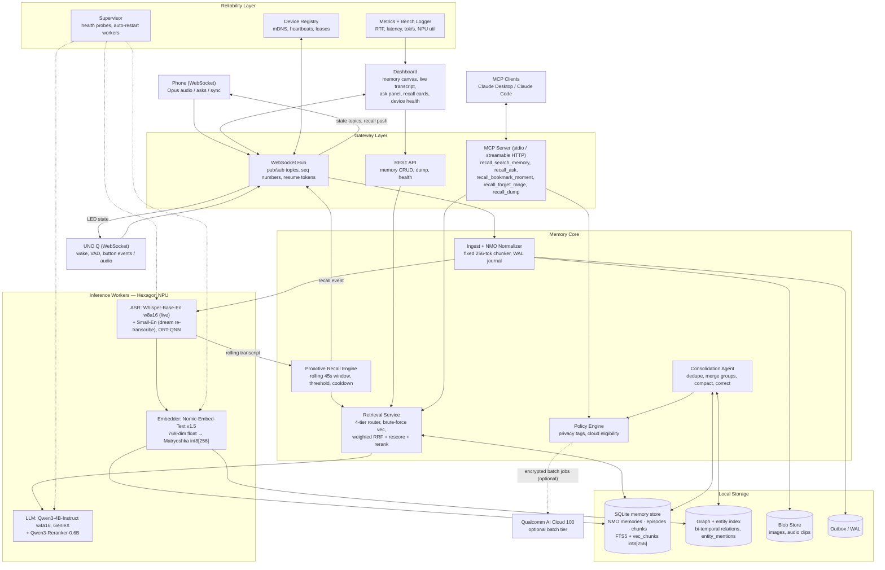

# Recall — Architecture Diagrams

> Memory-layer detail (NMO schema, fixed-size chunking, 4-tier router,
> two-tier Matryoshka vectors, consolidation) lives in
> `plans/memory_engineering_v2.md` — that doc is the source of truth for
> everything inside the Memory Core boxes below.

## 1. System Topology

## 2. Arduino UNO Q — Linux + MCU Split

## 3. Phone App — Capture, Degraded Mode, Self-Heal

## 4. PC Hub — Full Backend Architecture

